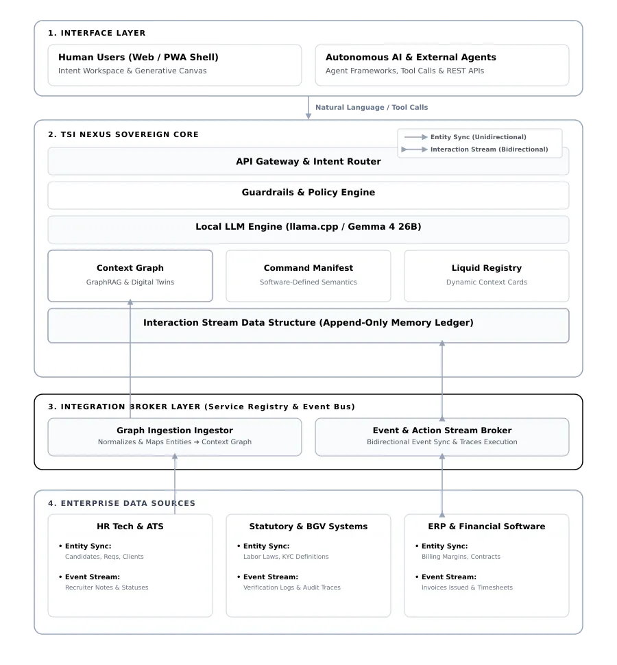

# TSI Nexus

An open-source, sovereign institutional intelligence platform that lets your AI Assistant listen, understand, and act.

It provides a private "company brain" - a single system that stores every entity, relationship, rule, and interaction, and surfaces them through a natural language interface.

Zero sector-specific logic is hardcoded. Every domain concept - entity types, terminology, policies, commands, templates - lives in database rows configured by the deploying institution.


## Why TSI Nexus

AI is changing how people use software. We are moving away from menus and forms to just asking by voice and getting things done. This shift is happening fast, and it goes beyond building a chat window on top of existing software. If users are going to ask in plain language, the system underneath has to understand the business and enforce business rules. Our current systems are not built to do that.

So what does the system actually need?

1. **Connected View** - Every person, asset, branch, and relationship between them needs to be organised in one place.
2. **Tunable Intelligence** - Every organisation has its own terms & slang, job titles, and shorthand. The system needs to understand that vocabulary.
3. **Adaptable Interface** - Instead of menu-driven form interfaces, the users should be able to say or type what they need.
4. **Memory Layer** - Every daily update needs to be recorded automatically.
5. **Reasoning Engine** - To connect the dots, compare options, and explain why it happened.
6. **Integration Gateway** - To plug in and pull data in from / push actions out to LLMs, CRMs, HR systems, industrial automation gateways, whatever an organisation already runs.
7. **Control & Audit Layer** - Every action taken by the agent should be checked against organisation rules. If the rules are not met, the system should be able to bring in a Human-in-the-Loop (HITL) for action approval. If you are RBI/SEBI regulated, you should be able to furnish reports as per their AI governance guidelines.

### Example use cases

- An agricultural broker sends a WhatsApp voice message in Hindi, stating the quantity and price they want. The system understands it, checks with the suppliers, and replies in the same chat with the offer price. When the broker initiates the purchase order, it confirms that the supplier has actually responded.
- A credit operator says, "Disburse the loan for customer ID 4521," instead of clicking through six screens. The system checks whether that customer has cleared KYC verification, underwriting and documentation before initiating the disbursement action.
- A homeowner says "good night" once. The system checks if the doors are locked before dimming the lights and turning the AC to sleep mode.

Different industries, but the same seven requirements underneath. It perfectly aligns with our philosophy of sovereign composable data infrastructure, and we have created an open-source tool. It's called TSI Nexus, an Apache 2.0 licensed institutional intelligence platform for small & medium organisations that enables an AI operator to listen, understand, and act.

These seven requirements map directly onto the platform's six architectural pillars - Connected View is the Context Graph, Tunable Intelligence and the Reasoning Engine are handled by Intelligence Tuning, Adaptable Interface is Liquid, Memory Layer is the Interaction Stream, Integration Gateway is the Service Registry, and Control & Audit Layer is Guardrails (extended with HITL escalation and regulatory reporting).

## What it does

**For end users (the Liquid interface)**
- Search for any entity by name, ID, or voice, using plain English
- View a live context card showing the entity's current state, graph relationships, and external data
- Submit structured forms (Input Manifests) to record actions and update state
- All actions are logged to an append-only interaction stream

**For admins (the Admin UI)**
- Define entity types, relationships, and their data shapes
- Build context cards (HTML templates with live variable substitution)
- Create input forms for data capture
- Configure guardrails (SQL policies that block or flag invalid actions)
- Register external service integrations (PULL / PUSH / INGEST)
- Seed a fully configured demo instance from a plain-English industry description


## How organisations use it

**Intent to command:** Field staff type or speak natural language requests. TSI Nexus maps them to exact registered command verbs like `/disburse_loan` or `/verify_kyc`, with no ambiguity and no drift from institutional policy.

**Policy evaluation:** Before any command executes, TSI Nexus checks it against the live context and business rules stored in the knowledge graph. It either approves, blocks, or flags for escalation - keeping every action within the institution's defined guardrails.

## Architecture



See [`docs/architecture.md`](docs/architecture.md) for a full breakdown of the six pillars, service registry patterns, seeder pipeline, LLM integration points, and database schema.


## Getting started

Watch the [video walkthrough](https://youtu.be/vvCECWRBTms) for a full end-to-end demo before diving in.

### Prerequisites
- Docker and Docker Compose
- An LLM endpoint - a self-hosted model (e.g. vLLM serving Gemma) or a hosted provider (OpenAI, Anthropic Claude, Google Gemini, Sarvam)

### 1. Configure environment

Copy the example env file and edit it:

```
cp .env.example .env
```

Key variables:

| Variable | Default | Description |
|---|---|---|
| `LLM_PROVIDER` | `openai-compatible` | Which provider adapter to use - see [LLM providers](#llm-providers) below |
| `LLM_BASE_URL` | `http://192.168.1.77:8001` | Base URL of your LLM endpoint |
| `LLM_MODEL` | `gemma-4-26B-A4B-it` | Model name |
| `LLM_API_KEY` | *(empty)* | API key, if the provider requires one |
| `APP_PORT_MAP` | `8084:8080` | Host port mapping |
| `DB_PORT_MAP` | `5436:5432` | Postgres port mapping |
| `POSTGRES_PASSWD` | `secure_dev_password` | Change for production |
| `TSI_NEXUS_JWT_SECRET` | **Required** | Generate with `openssl rand -hex 32`. Container refuses to start without it. |

#### LLM providers

TSI Nexus is built sovereignty-first: it defaults to open-weight models you self-host and actively supports home-grown models such as Sarvam AI. Nexus talks to LLMs through a provider-neutral client (`LLMClient.java`) - set `LLM_PROVIDER` to pick the adapter, then supply the matching variables. The choice of model is entirely at the deploying institution's discretion:

| `LLM_PROVIDER` | Use for | Required vars | Notes |
|---|---|---|---|
| `openai-compatible` (default) | Self-hosted, open-weight models via vLLM or any `/v1/chat/completions` server - **including Gemma** | `LLM_BASE_URL`, `LLM_MODEL` | `LLM_API_KEY` optional (send `dummy` if your server ignores it) |
| `sarvam` | Sarvam - Indian, multilingual-first hosted models | `LLM_BASE_URL`, `LLM_MODEL`, `LLM_API_KEY` | Optional `LLM_AUTH_HEADER` (default `api-subscription-key`) |
| `openai` | OpenAI hosted models | `LLM_BASE_URL`, `LLM_MODEL`, `LLM_API_KEY` | Same request shape as `openai-compatible`, sent with a real `Authorization: Bearer` key |
| `claude` (or `anthropic`) | Anthropic Claude | `LLM_BASE_URL`, `LLM_MODEL`, `LLM_API_KEY` | Maps to the Messages API; optional `LLM_API_VERSION` (default `2023-06-01`) |
| `gemini` (or `google`) | Google Gemini | `LLM_BASE_URL`, `LLM_MODEL`, `LLM_API_KEY` | Maps to `generateContent`; optional `LLM_AUTH_HEADER` (default `x-goog-api-key`) |

Optional overrides for any provider: `LLM_CHAT_PATH` (custom completion path/endpoint).

**Env examples**

```bash
# Self-hosted, open-weight - e.g. Gemma via vLLM (default)
LLM_PROVIDER=openai-compatible
LLM_BASE_URL=http://192.168.1.77:8001
LLM_MODEL=gemma-4-26B-A4B-it

# Sarvam (India)
LLM_PROVIDER=sarvam
LLM_BASE_URL=https://api.sarvam.ai
LLM_MODEL=sarvam-m
LLM_API_KEY=sk_...

# OpenAI
LLM_PROVIDER=openai
LLM_BASE_URL=https://api.openai.com
LLM_MODEL=gpt-4o
LLM_API_KEY=sk-...

# Anthropic Claude
LLM_PROVIDER=claude
LLM_BASE_URL=https://api.anthropic.com
LLM_MODEL=claude-sonnet-5
LLM_API_KEY=sk-ant-...

# Google Gemini
LLM_PROVIDER=gemini
LLM_BASE_URL=https://generativelanguage.googleapis.com
LLM_MODEL=gemini-2.5-flash
LLM_API_KEY=AIza...
```

### 2. Build and run

```bash
mvn package -q
docker compose up -d
```

Once running, the platform is accessible at these URLs (default port `8084`):

| Tool | URL | Purpose |
|---|---|---|
| Setup wizard | `http://localhost:8084/setup` | First-run account creation |
| Seed tool | `http://localhost:8084/seed` | Bootstrap a demo institution |
| Liquid interface | `http://localhost:8084/liquid` | End-user natural language search and forms |
| Admin UI | `http://localhost:8084/admin` | Configure entities, templates, policies, and services |

### 3. First-time setup

**Step 1 - Create your admin account**

Open `http://localhost:8084/setup` and complete the wizard.

**Step 2 - Explore the admin console**

Open `http://localhost:8084/admin`. This is where you configure entity types, context card templates, input forms, guardrails, and external service integrations.

**Step 3 - Seed your institution**

Open `http://localhost:8084/seed` and fill in the four steps: institutional context, entity types, commands, and simulation parameters. The seeder generates digital twins, interaction history, context cards, forms, policies, and mock service integrations in one pass.

Ready-to-use input values for common domains:

| Domain | Guide |
|---|---|
| Microfinance (JLG / rural lending) | [`docs/seed/microfinance.md`](docs/seed/microfinance.md) |
| Healthcare clinic | [`docs/seed/healthcare-clinic.md`](docs/seed/healthcare-clinic.md) |
| Manufacturing firm | [`docs/seed/manufacturing.md`](docs/seed/manufacturing.md) |
| EdTech platform | [`docs/seed/edtech.md`](docs/seed/edtech.md) |
| Professional services | [`docs/seed/services.md`](docs/seed/services.md) |

Each guide provides exact copy-paste text for every field in the seed form.

**Step 4 - Start the mock integration server**

After seeding, download `mock-data.json` from the seeding page, place it in `examples/integrations/`, then run:

```bash
javac examples/integrations/MockServer.java
java -cp examples/integrations MockServer
```

This starts a PULL server on port 9090 and a background INGEST push thread. Without this step, context cards in Liquid will have empty live-data fields.

**Step 5 - Explore in Liquid**

Open `http://localhost:8084/liquid` and start exploring your entities. Search by name or ID, view context cards with live external data, and submit forms to record actions.

### 4. Run example agents

The `examples/agents/` directory contains small Python test agents for each seeded domain. They exercise the headless Intelligence API by resolving natural language, loading entity context, checking guardrails, and discovering capture forms.

Create an API key from Admin UI → API Keys with these scopes:

```json
["intent:read", "context:read", "governance:read", "capture:write"]
```

Export the connection details:

```bash
export NEXUS_BASE_URL=http://localhost:8084
export NEXUS_API_KEY=nxs_your_key
export NEXUS_API_SECRET=your_secret
```

Run the agent that matches your seeded domain:

```bash
python3 examples/agents/run_domain_agent.py microfinance
python3 examples/agents/run_domain_agent.py healthcare
python3 examples/agents/run_domain_agent.py manufacturing
python3 examples/agents/run_domain_agent.py edtech
python3 examples/agents/run_domain_agent.py services
python3 examples/agents/run_domain_agent.py hr_services
```

See [`examples/agents/README.md`](examples/agents/README.md) for details.


## Development

### Build

```bash
mvn package
```

Output: `target/tsi_nexus.war`

### Run locally with Docker

```bash
docker compose up --build
```

### Database

The schema lives in `db/init.sql`. It is applied automatically on first container start. To reset:

```bash
docker compose down -v
docker compose up -d
```

### Mock external services

See Step 4 in [First-time setup](#3-first-time-setup). The mock integration server (`examples/integrations/MockServer.java`) serves as a standalone PULL endpoint and INGEST push source - no real external systems needed for a full demo.


## Integrating external systems

TSI Nexus integrates via three patterns registered in the Admin UI:

| Pattern | Direction | Use case |
|---|---|---|
| **PULL** | Nexus → your system | Enrich entity context at read time (credit scores, live balances, HR data) |
| **PUSH** | Nexus → your system | Notify your system after a form is submitted |
| **INGEST** | Your system → Nexus | Push state updates into Nexus from an external source |

See [`docs/integration-guide.md`](docs/integration-guide.md) for the full API contract, request/response examples, and registration instructions.

For headless access to the intelligence API from external apps or AI agents, see [`docs/api-client-sdk.md`](docs/api-client-sdk.md).


## Project structure

```
src/          Java source (Jakarta EE, no framework dependencies)
web/          Frontend - admin UI and Liquid interface (plain HTML/JS)
db/           init.sql - full schema, applied on first DB start
examples/     Python domain agents (examples/agents/) and the mock integration server (examples/integrations/)
docs/         Documentation, integration guides, seed guides, and diagrams
```


## License & Contributions

This project is fully open-source and distributed under the **Apache 2.0 License**. You are completely free to fork, modify, and customize the codebase to fit your specific technical or enterprise needs without any restriction.

### Contributing Back to the Main Project
If you have built an optimization, bug fix, or feature extension that you believe would add value to the core platform, we would love to review it. To ensure the main repository remains highly stable and securely managed, direct commits to the `main` branch are restricted.

If you wish to give back your changes to the project, please follow this process:

* **Email the Repository Owner:** Send a brief summary of your modifications and a link to your code branch directly to **admin@tsicoop.org**.

Every contribution is manually evaluated for architectural alignment, readability, and long-term maintenance impact before integration. Thank you for respecting this workflow and helping us maintain a clean, resilient core!
